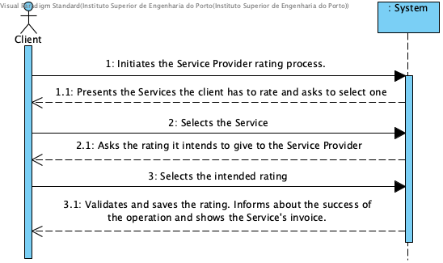

# UC14 - Rating Service Provider

## Brief Description
The HRO starts the rating of a service provider. The System presents the Services the client has to rate and asks to select one. The Client tells which Service the rating reffers to. The system asks the Client which rating does he intend to give to the Service Provider. The Clients rates the Service Provider. The System validates and saves the rating and informs the Client of the success of the operation. The System also shows the Invoice of the Service performed by the Service Provider.

## SSD

## Full Description,

### Primary Actor

Client

### Stakeholders and purposes
* **Company:** Is interested in knowing what the Client thought about the Service provided.
* **Service Provider:** Is interested in knowing if its Services are up to the Client's expectations.
* **Client:** Is interested in having the opportunity to evaluate the Service provided.

### Preconditions

The Service must have been considered complete by the Service Provider.

### Postconditions

The Service Provider's rating is saved in the System.

## Main Success scenario
1. The Clients initiates the Service Provider rating process.
2. The System presents the Services the client has to rate and asks to select one.
3. The Clients selects the Service.
4. The System asks what rating the Clients wants to assign to the Service Provider.
5. The Clients rates the Service Provider.
6. The System validates and saves the rating and informs the Client of the success of the operation.The System also shows the Invoice of the Service performed by the Service Provider.

### Exception conditions (alternative flow)

### Special requirements
* The rating scale is 0 - 5.

### Variations in technologies and data
\-

### Frequency of occurrence
\-
