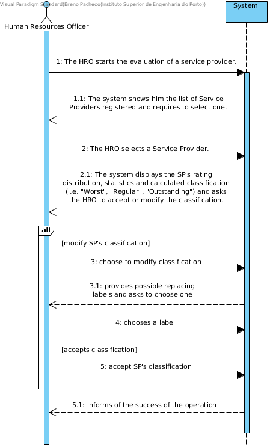

# UC15 - Evaluate Service Provider

## Brief Description

The HRO starts the evaluation of a service provider. The system shows him the list of Service Providers registered and requires to select one. The HRO selects a Service Provider. The system displays the SP's rating distribution and statistics related to the Service Provider's rating. The system displays the SP's rating distribution, statistics and calculated classification (i.e. "Worst", "Regular", "Outstanding") and asks the HRO to accept or modify the classification. The HRO accepts or chooses to modify the SP's classification. In case the HRO accepts the label, the Use Case ends. In case the HRO wishes to modify the SP's classification, the System provides the possible replacing labels and asks the HRO to choose one. The HRO chooses ones. The System registers his choice and informs the HRO of the success of the operation. 

## SSD

## Full Description,

### Primary Actor

Human Resources Officer

### Stakeholders and purposes
* **HRO:** Is interested in vieweing statistics about a Service Provider's ratings and being able to define his classification in the system.
* **Company:** Is interested in having the Service Provider's statistics available for the HRO's evaluation and his classification available for the User's analysis when accepting/rejecting a Service Assignment.
* **Service Provider:** Is interested in having his classification available for analysis and modification.
* **User:** Is interested in having the Service Provider's classification available for accepting/rejecting Service Assignments.

### Preconditions

The Service Provider must be registered in the system.

### Postconditions

The Service Provider's classification is defined in the system.

## Main Success scenario 
1. The HRO starts the evaluation of a service provider. 
2. The system shows him the list of Service Providers registered and requires to select one. 
3. The HRO selects a Service Provider. 
4. The system displays the SP's rating distribution, statistics and calculated classification (i.e. "Worst", "Regular", "Outstanding") and asks the HRO to accept or modify the classification. 
5. 
	a. The HRO accepts the classification. (step 10)
	b. The HRO chooses to modify the classification. (step 6)
7. The System provides the possible replacing labels and asks the HRO to choose one. 
8. The HRO chooses ones. 
9. The System registers his choise and informs the HRO of the success of the operation.
10. The Use Case ends.

### Exception conditions (alternative flow)

*a. The HRO requests cancelation of the Service Provider Evaluation.

> The Use Case ends.

2a. No Service Provider is found by the System.
> 1. The System informs the HRO that the System does  and the Use Case ends.

4a. The Service Provider does not posess any ratings.
> 1. The System informs the HRO and allows

### Special requirements
* The SP's rating distribution must be displayed in form of an histogram (values between 0-5)
* The statistics provided by the system must be displayed in form of graphic charts and must include:
	1. Average rating for the SP.
	2. Average rating for all SP's.
	3. Standard deviation of the ratings for all SP's.
	2. The absolute differences (deviation) between the average ratings of each service provider and the mean rating of all service providers. ???
* The SP's classification must be made considering the population mean rating accordingly:
	1. "Worst Providers": average rating below one std. deviation (sigma) of the population mean average.
	2. "Regular Providers": average rating between one std. deviation (sigma) bellow and above the population mean average.
	3. "Outstanding Providers": average rating above one std. deviation (sigma) of the population mean average.

### Variations in technologies and data
\-

### Frequency of occurrence
\-

### Open questions

* Is the SP's classification the only data that needs to be stored?
