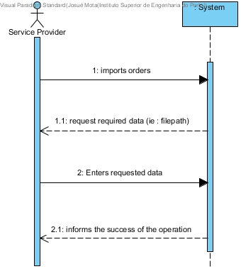

# UC16 - Import Service Orders.

## Brief Description

The client begins to import orders. The System requests the required data (i.e. filepath). The Client enters the requested data. The System informs the success of the operation.

## SSD

## Full Description,

### Primary Actor

Service Provider

### Stakeholders and purposes

* **Company:** is interested in having an import mechanism to allow the orders to be imported from a file (csv, xml, xlsx).
* **Service Provider:** is interested in consulting the service orders from a file

### Preconditions
\-

### Postconditions
The orders are stored in the system.

## Main Success scenario 
1. The Service Provider begins to import orders.
2. The System requests the required data (i.e. filepath).
3. The Service Provider enters the requested data.
4. The System informs the success of the operation.

### Exception conditions (alternative flow)
*a. The Service Provider requests the cancellation of the registration.

> The use case ends.

### Special requirements
\-

### Variations in technologies and data
\-

### Frequency of occurrence
\-

### Open questions
* ~~Should the SP Application validate if the imported orders match the Service Provider?~~