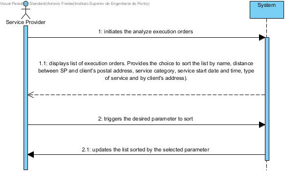

# UC17 Analyze Execution Orders

## Brief Description
The Service Provider initiates the analyze execution orders. The systems displays every execution orders and provides the choice to sort the list by the parameters available on execution orders (name, distance between SP and client's postal address, service category, service start date and time, type of service and by client's address). The service provider triggers the desired parameter to sort. The systems sorts the execution orders list by the selected parameter and displays it.

## SSD

## Full Description

### Primary Actor
Service Provider

### Stakeholders and purposes
* **Service Provider:** wants to analyze all execution orders and to be able to sort the records.
* **Company:** has an interest to give the service provider a tool to analyze the records of execution orders.

### Preconditions
The SPApplication needs to have the execution orders imported and available.

### Postconditions

## Main Success scenario (or basic flow)
1. The Service Provider initiates the analyze execution orders.
2. The systems displays every execution orders and provides the choice to sort the list by the parameters available on execution orders (name, distance between SP and client's postal address, service category, service start date and time, type of service and by client's address).
3. The service provider triggers the desired parameter to sort.
4. The systems sorts the execution orders list by the selected parameter and displays it.

### Exception conditions (alternative flow)

*a. The Service Provider request the cancellation of analyze Execution Orders.
> The use case ends.

2.a The system does not have execution orders to display.
> The use case ends.*

### Special requirements
\-

### Variations in technologies and data
\-

### Frequency of occurrence
\-

### Open questions

- The execution orders to display are all or just the ones that are yet to be performed by the service provider?
