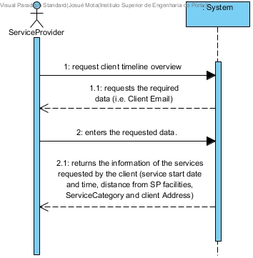

# UC18 - Analyze Client Timeline

## Brief Description

The Service Provider requests the client timeline overview. The System requests the required data (i.e. Client Email). The Service Provider enters the requested data.. The system returns the information of the services requested by the client (service start date and time, distance from SP facilities, ServiceCategory and client Address).

## SSD

## Full Description,

### Primary Actor

Service Provider

### Stakeholders and purposes

* **Company:** Is interested in having the Client Service Timeline in order to grant the Service Provider a better context of the service.
* **Service Provider:** Is interested in having Client Timeline for analysis.

### Preconditions
\-

### Postconditions
\-

## Main Success scenario 
1. The Service Provider requests the client timeline overview.
2. The System requests the required data (i.e. Client Email).
3. The Service Provider enters the requested data..
4. The system returns the information of the services requested by the client (service start date and time, distance from SP facilities, ServiceCategory and client Address).

### Exception conditions (alternative flow)

### Special requirements
* The timeline should include:
	1. distance from SP facilities to client’s home,
	2. service category
	3. type of service
	4. client’s address
	

### Variations in technologies and data
\-

### Frequency of occurrence
\-

### Open questions

* Are there any other mandatory data besides those already known? (i.e Report Issue and Troubleshooting Strategy)

