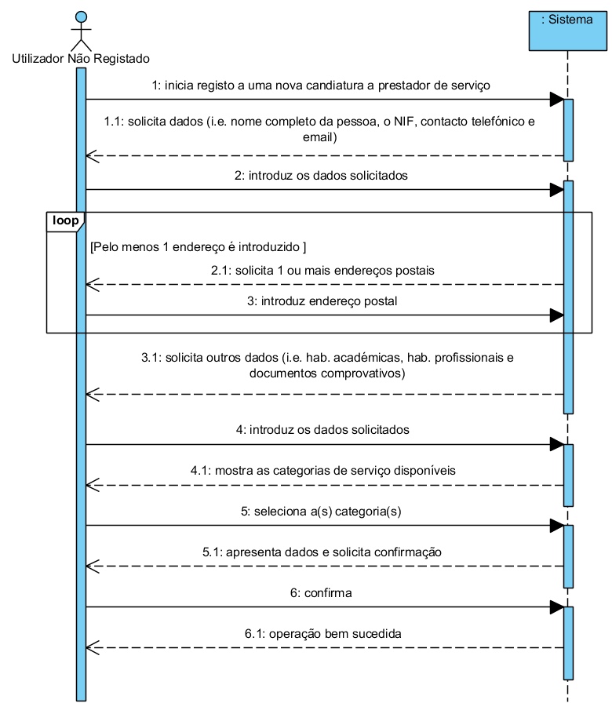

# UC2 - Submit application for service provider

## Brief description

The unregistered user initiates the registration of a new application for service provider. The system requests the necessary data for the application (full name NIF, phone number, email, postal address (at leats one), academic and professional qualifications and supporting documents). The unregistered user enters the requested data. The system shows the service categories and requests the user to select those whose servers he wishes to provide. The unregistered user select the desired categories. The system validates and displays the data, asking to confirm them. The unregistered user confirms the application. The system registers the new application and informs the user that success of the operation.
## SSD

### Primary Actor

Unregistered user

### Stakeholders and their interests

** Unregistered user: ** wishes to submit his application for service provider.

** Company: ** wants anyone who wishes to collaborate with the company to submit their application for service provider.

### Preconditions

n/a

### Post-conditions

An application for service provider is registered in the system.

### Main success scenario

1. The unregistered user initiates the submission of a new application for service provider.

2. The system requests the necessary data (i.e. full name, NIF, phone number, email).

3. The unregistered user enters the requested data.

4. The system requests a postal address.

5. The unregistered user enters the postal address.

6. The system validates and stores the address.

7. Steps 4 to 6 are repeated until all postal addresses are provided (minimum 1).

8. The system requires an academic qualification.

9. The unregistered user introduces the academic qualification

10. The system validates and holds the academic qualification.

11. Steps 8 to 10 are repeated until all academic qualifications have been entered.

12. The system requires a professional qualification.

13. The unregistered user introduces the professional qualification.

14. The system validates and holds the professional qualification.

15. Steps 12 to 14 are repeated until all professional qualifications have been completed.

16. The system requests supporting documents proving the user's qualification.

17. The unregistered user introduces the document.

18. The system validates and holds the document.

19. Steps 16 to 18 are repeated until all supporting documents have been entered.

20. The system shows the categories of services available in the system.

21. The unregistered user selects the category of services he intends to perform.

22. The system validates and stores the selected category.

23. Steps 20 to 22 are repeated until all categories are entered.

24. The system validates and presents the application data to the unregistered user and asks him to confirm them.

25. The unregistered user confirms the application details.

26. The system registers the new application and informs the unregistered user of the success of the operation.

### Extensions (alternative flow)

\*The. The unregistered user requests the cancellation of the application submission.

> End of use case.

6a. Incomplete Postal Address Information.

> 1. The system informs the user of about the missing data.

> 2. The system allows the missing data to be entered (step 5)

>> 2a. The unregistered user does not change the data. The use case ends.

10a. Incomplete Academic Enrollment Data.

> 1. The system informs the user of missing data.

> 2. The system allows the user to enter the missing data (step 9)

>> 2a. The unregistered user does not change the data. The use case ends.

14a. Incomplete Professional Qualification Data.

> 1. The system informs the user of missing data.

> 2. The system allows the user to enter the missing data (step 13)

>> 2a. The unregistered user does not change the data. The use case ends.

14a. Document format is not supported.

> 1. The system system informs the user.

> 2. The system allows the user to enter another document (step 13)

>> 2a. The unregistered user does not change the data. The use case ends.

20a. The system has no service categories to display.

> 1. The system informs that there are no service categories.

>> The use case advances to step 24.

24a. Required minimum data missing.

> 1. The system informs the user of missing data.

> 2. The system allows the missing data to be entered (step 3)

>> 2a. The unregistered user does not change the data. The use case ends.

24b. The system detects that the data (or any subset of the data) entered must be unique and already exist in the system.

> 1. The system alerts the unregistered user to the fact.

> 2. The system allows the user to change it (step 3)

>> 2a. The unregistered user does not change the data. The use case ends.

24c. The system detects that the data entered (or some subset of the data) are invalid.

> 1. The system alerts the unregistered user to the fact.

> 2. The system allows the user to change it (step 3).

>> 2a. The unregistered user does not change the data. The use case ends.

### Special Requirements

n/a

### List of Variations in Technologies and Data

n/a

### Frequency of Occurrence

n/a

### Open questions

- What are the mandatory data for a valid application?

- What are the necessary data related to Academic Qualification?

- What are the necessary data related to a Professional Qualification?

- What is the data that uniquely identifies an application?

- How does the unregistered user know that his / her application has been accepted?

- There is a limit of categories of services to which the unregistered user can the user apply?

- Who is responsible for promoting the candidate to an effective service provider in the company?
