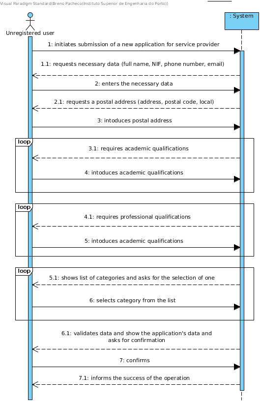

# UC2 - Submit application for service provider

## Brief description

The unregistered user initiates the registration of a new application for service provider. The system requests the necessary data for the application (full name NIF, phone number, email). The unregistered user enters the requested data. The system requests an address (address, postal code, local). The unregistered user enters the data. The system requests academic and professional competences (one or more). The unregistered user enters the requested data. The system shows the service categories and requests the user to select those whose services he wishes to provide (one or more). The unregistered user select the desired categories. The system validates and displays the data, asking to confirm them. The unregistered user confirms the application. The system registers the new application and informs the user that success of the operation.
## SSD

### Primary Actor

Unregistered user

### Stakeholders and their interests

** Unregistered user: ** wishes to submit his application for service provider.

** Company: ** wants anyone who wishes to collaborate with the company to submit their application for service provider.

### Preconditions

n/a

### Post-conditions

An application for service provider is registered in the system.

### Main success scenario

1. The unregistered user initiates the submission of a new application for service provider.

2. The system requests the necessary data (i.e. full name, NIF, phone number, email).

3. The unregistered user enters the requested data.

4. The system requests a postal address (i.e address, postal code, local).

5. The unregistered user enters the request data.

6. The system requires an academic qualification.

7. The unregistered user introduces the academic qualification (i.e. course, level, grade)

8. Steps 6 to 7 are repeated until all academic qualifications have been entered.

9. The system requires a professional qualification.

10. The unregistered user introduces the professional qualification (i.e. description).

11. Steps 9 to 10 are repeated until all professional qualifications have been completed.

12. The system shows the categories of services available in the system.

13. The unregistered user selects the category of services he intends to perform.

14. The system validates and stores the selected category.

15. Steps 12 to 14 are repeated until all categories are entered.

16. The system validates and presents the application data to the unregistered user and asks him to confirm them.

17. The unregistered user confirms the application details.

18. The system registers the new application and informs the unregistered user of the success of the operation.

### Extensions (alternative flow)

\*The. The unregistered user requests the cancellation of the application submission.

> End of use case.

5a. Incomplete Postal Address Information.

> 1. The system informs the user of about the missing data.

> 2. The system allows the missing data to be entered (step 4)

>> 2a. The unregistered user does not change the data. The use case ends.

7a. Incomplete Academic Enrollment Data.

> 1. The system informs the user of missing data.

> 2. The system allows the user to enter the missing data (step 7)

>> 2a. The unregistered user does not change the data. The use case ends.

10a. Incomplete Professional Qualification Data.

> 1. The system informs the user of missing data.

> 2. The system allows the user to enter the missing data (step 10)

>> 2a. The unregistered user does not change the data. The use case ends.

12a. The system has no service categories to display.

> 1. The system informs that there are no service categories.

>> The use case advances to step 16.

14a. The system verifies that a category has been entered twice.

> 1. The system informs that the category has already been selected.

>> The use case advances to step 13

16a. Required minimum data missing.

> 1. The system informs the user of missing data.

> 2. The system allows the missing data to be entered (step 4)

>> 2a. The unregistered user does not change the data. The use case ends.

16b. The system detects that the data entered (or some subset of the data) are invalid.

> 1. The system alerts the unregistered user to the fact.

> 2. The system allows the user to change it (step 3).

>> 2a. The unregistered user does not change the data. The use case ends.

### Special Requirements

n/a

### List of Variations in Technologies and Data

n/a

### Frequency of Occurrence

n/a

### Open questions
