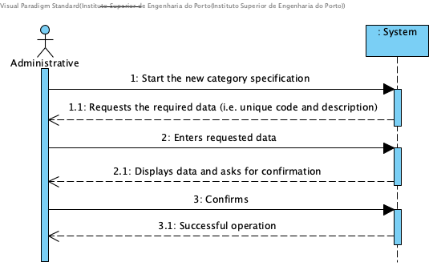

# UC3 - Category Specification

## Brief Description

The administrative begins to specify a new category. The system requests the required data (i.e., unique code and description). The administrator enters the requested data. The system validates and presents the data to the administrative, asking him to confirm. The administrative confirms. The system records the data and informs the administrativo of the success of the operation.

## SSD

## Full Description

### Primary Actor

Administrative

### Stakeholders and their interests
* **Administrative:** intends to specify the categories of services so that it can later catalog the various services provided.
* **Client:** cataloging the services into categories facilitates how the Client makes a Service Request.
* **Company:** wants to be able to catalog its services.

### Preconditions
n/a

### Postconditions
Category information is recorded in the system.

## Main Success Scenario

1. The Administrative begins to specify a new category.
2. The system requests the required data (i.e. unique code and description).
3. The Administrative enters the requested data.
4. The system validates and presents the data to the administrative, asking him to confirm them.
5. The Administrative confirms.
6. The system records the data and informs the Administrative of the success of the operation.

### Exception conditions (alternative flow)

*a. The Administrative requests the cancellation of the category specification.

> The use case ends.

4a. Required data missing.
> 1. The system informs of missing data.
> 2. The system allows the missing data to be entered (step 3)
>
> 2a. The administrative does not change the data. The use case ends.

4b. The system detects that the data (or some subset of the data) entered must be unique and already exist in the system.
> 1. The system alerts the administrative to the fact.
> 2. The system allows to change it (step 3)
>
> 2a. The administrative does not change the data. The use case ends.

4c. The system detects that the entered data (or some subset of the data) is invalid.
> 1. The system alerts the administrative to the fact.
> 2. The system allows to change it (step 3).
>
> 2a. The administrative does not change the data. The use case ends.
### Special Requirements
\-

### Variations in Technologies and Data
\-

### Frequency of Occurrence
\-

### Open questions

* Are there other data that are needed?
* What are the mandatory data for specifying a category?
* What data together allow you to detect duplication of categories?
* Is the unique code always entered by the administrator or should the system automatically generate it?
* How often does this use case occur?
