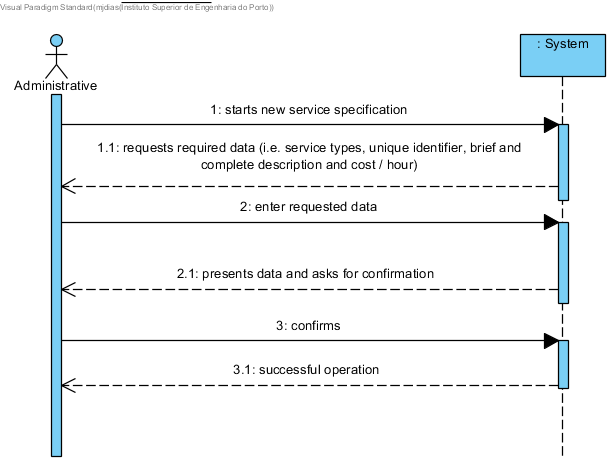

# UC4 - Service definition

## Brief Description

The administrative begins to specify a new service. System shows types of services supported and prompts to select one. The administrative selects the wanted type of service. System requests the required data (i.e. service type, unique identifier, brief and complete description, category in which it is catalogued, and cost per hour). The administrative enters the requested data. System shows a list of existing categories so that one is selected. The administrative selects the category in which he wants to catalogue the service. The system requests additional data if the type of service warrants it. The admin enters the requested data. System validates and presents data to the administrative, asking him to confirm them. The administrative confirms. System records data and informs the success of the operation.

## SSD

## Full Description

### Primary Actor

Administrative

### Stakeholders and Interests
* **Administrative:** specifies the services provided so that they can be requested by customers.
* **Client:** wants to know the services he can request
* **Company:** wants the services described with detail and well catalogued.

### Preconditions
n/a

### Postconditions
Service information is registered in the system.

## Main Success Scenario

1. The administrative begins to specify a new service.
2. System shows types of services supported and prompts to select one.
3. The administrative selects the wanted type of service.
4. System requests the required data (i.e. service type, unique identifier, brief and complete description, category in which it is catalogued, and cost per hour).
5. The administrative enters the requested data.
6. System shows a list of existing categories so that one is selected.
7. The administrative selects the category in which he wants to catalogue the service.
8. The system requests additional data if the type of service warrants it.
9. The admin enters the requested data.
10. System validates and presents data to the administrative, asking him to confirm them.
11. The administrative confirms.
12. System records data and informs the success of the operation.

### Exception Conditions (alternative flow)

*a. The administrative requests the service specification to be cancelled.

> The use case ends.

2a. There are no service types defined in the system.
> 1. The system informs the administrative of this fact. The use case ends.

6a. There are no service categories defined in the system.
>   1. The system informs the administrative of this fact.
>   2. The system allows the creation of a new category (UC 3).
>
	> 2a. Administrative does not create a category. The use case ends.

8a. It is not necessary to request more data.
> 1. The system proceeds immediately to step 10.

10a. Required minimum data missing.
>	1. The system tells you which data is missing.
>	2. The system allows you to enter the missing data (step 3)
>
	>	2a. The administrative does not change the data. The use case ends.

10b. The system detects that the data (or some subset of the data) entered must be unique and already exist in the system.
>	1. The system alerts the administrative to the fact.
>	2. The system allows you to change it (step 3)
>
	>	2a. The administrative does not change the data. The use case ends.

10c. The system detects that the entered data (or some subset of the data) is invalid.
>	1. The system alerts the administrative to the fact.
>	2. The system allows you to change it (step 3)
>
	> 2a. The administrative does not change the data. The use case ends.

### Special Requirements
\-

### Variations in technologies and data
\-

### Frequency of occurrence
\-

### Open Questions

* Are all data required for the specification of a service?
* Is it possible to specify a service with no associated category?
* Can a service belong to more than one category?
* What data together can detect duplication of services?
* Is the unique identifier always entered by the administrative, or should the system automatically generate it?
* Do I have to save the cost change history for a service?
* How often does this use case occur?
