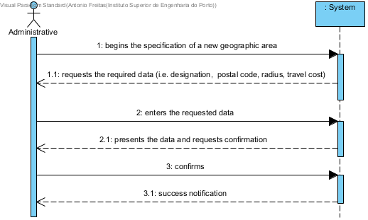

# UC5 - Geographic Area Specification

## Brief Description

The administrative begins to specify a new geographical area. The system requests the required data (i.e. designation, postal code, radius, travel cost). The administrative enters the requested data. The system gets the postal codes covered by the new geographical area, validates and presents the data and the administrative, asking to confirm the data. The administrative confirms. The system registers the new geographical area and informs the administrative the success of the operation.

## SSD

## Full Description

### Primary Actor

Administrative

### Stakeholders and purposes
* **Administrative:** wants to specify new geographic areas and to register the associated costs.
* **Client:** intents to know in which areas the company provides services and travel costs.
* **Company:** intents to have all the complete information regarding the geographic areas in which as Services to provide.

### Preconditions
n/a

### Postconditions
All data regarding the geographic area is registered in the system.

## Main success scenario (or basic flow)

1. The administrative begins the specification of a new geographic area.
2. The system requests the required data (i.e. designation,  postal code, radius, travel cost).
3. The administrator enters the requested data.
4. The system obtains the postal codes covered by the new geographical area, validates the gathered data and presents it to the administrative, requesting to confirm the data.
5. The administrative confirms.
6. The system adds the new geographic area to the system and informs the administrative of the success of the operation.

### Exception conditions (alternative flow)

*a. The administrator requests the cancellation of the operation to specify a geographic area.

> The use case ends.

4a. Minimum mandatory data missing.
> 1. The system informs the user which data is missing.
> 2. The system allows you to enter the missing data (step 3)
>
	> 2a. The administrative does not change the data. The use case ends.

4b. The system detects that the inserted data (or some subset) already exist in the system and must be unique.
>	1. The system alerts the administrative to this matter.
>	2. The systems allows the change (step 3)
>
	>	2a. The administrative does not change the data. The use case ends.

4c.  The system detects that the inserted data (or some subset) is invalid.
> 1. The system alerts the administrative to this matter.
> 2. The systems allows the change (step 3)
>
	> 2a. The administrative does not change the data. The use case ends.

4d. The system is not able to determine the postal codes covered by the geographical area.
> 1. The system alerts the administrative to this matter.
	> The use case ends.*

### Special Requirements
\-

### Variations in technologies and data
\-
The system must use an external service defined by configuration to obtain the postal codes covered by the geographical area

### Frequency of occurrence
\-

### Open questions

* What data together can detect the duplication of geographical areas?
* Is it necessary to maintain some historical cost of relocation associated with the geographical area?
* How often does this use case occur?
* **Should the system alert to territorial overlaps between geographic areas? **
* **Postal codes obtained through the external service can be modified (added, removed) by the administrative?**
