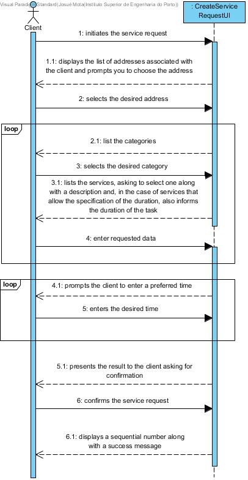

# UC6 - Create Service request

## Brief description

The client initiates the service request. The system displays the list of addresses associated with the client and prompts you to choose the address at which you want the services to be delivered. The client selects the desired address. The system presents the categories of services and asks the client to select one. The client selects the desired category. The system presents the services of this category, asking the client to select one of them along with a description of the task and, in the case of services that allow the specification of the duration, also informs the duration of the task. The client selects the desired service and enters the description and estimated duration. The system validates and stores the information entered. The system prompts the client to enter a preferred time (start date and time) to execute the task. The client enters the desired time The system validates and saves the time entered. Steps 10 through 12 are repeated until at least one time is set. The system validates the request, calculates the estimated cost, and presents the result to the client asking them to confirm. The client confirms the request. The system registers it, assigns it a sequential number, ** sends the request information by email to the client ** and presents it to the client together with a message of success.

## SSD

## Complete Format

### Primary actor

Client

### Stakeholders and interests
* **Client:** wants to register the request so that he can use the services provided by the company
* **Company:** want the clients to be able to request services.

### Preconditions
- There is at least one service defined in the system.

### Postconditions
The order information is stored in the system.

## Main success scenario

1. The client initiates the service request.
2. The system displays the list of addresses associated with the client and prompts you to choose the address at which you want the services to be delivered.
3. The client selects the desired address.
4. The system presents the categories of services and asks the client to select one.
5. The client selects the desired category.
6. The system presents the services of this category, asking the client to select one of them along with a description of the task and, in the case of services that allow the specification of the duration, also informs the duration of the task.
7. The client selects the desired service and enters the description and estimated duration.
8. The system validates and stores the information entered.
9. Steps 4 through 8 are repeated until all services desired by the client are specified.
10. The system prompts the client to enter a preferred time (start date and time) to execute the task.
11. The client enters the desired time
12. The system validates and saves the time entered.
13. Steps 10 through 12 are repeated until at least one time is set.

14. The system validates the request, calculates the estimated cost, and presents the result to the client asking them to confirm.
15. The client confirms the request.
16. The system registers it, assigns it a sequential number, ** sends the request information by email to the client ** and presents it to the client together with a message of success.

### Exception conditions (alternative flow)

*a. The client requests the cancellation of the registration.

> The uc ends.

2a. The system detects that the client only has a postal address.
>   1. The system uses the address and informs the client.
>    2. The system advances to step 4.

**3a. The client informs that he / she wants to use another postal address.**
>    1. The system allows the client to associate another address with their information (UC7).
>   2. The system goes back to step 2.

6a. There are no services specified for the category selected.
> 1. The system informs the customer of this fact.
> 1. O sistema informa o cliente de tal facto.
> 2. The system allows the selection of another category (step 5).

8a. Required minimum data missing.
>    1. The system displays the missing data.
>    2. The system allows the client to enter the missing data (step 7)

12a. Required minimum data missing.
>    1. The system displays the missing data.
>    2. The system allows the client to enter the missing data (step 10)

The system detects that the data is invalid
14a. The system detects that the data is invalid.
> 1. The system alerts the client. 
> 2. The system allows the client to change the data (passo 3).
> 
    > 2a. The client does not change the data. The uc ends. 

### Special requirements

- **The minimum time for performing any service is 30 minutes, and it is only possible to request multiples of this value.**
- **The duration indication is limited by the selected service type.**

### Variations in technologies and data
\-

### Frequency of occurrence
\-

### Open questions

* The client can place an order without specifying a category?
* The description of the task to be performed is a mandatory?
* What is the maximum number of schedule preferences.
* ~~For services that require the indication of the amount of time, should this be interpreted as the maximum or minimum amount of time? It is a mandator?~~
* ~~The amount of time is a value in hours. Is an integer value or supports decimal part?~~
* The system must assume that there is infinite capacity to perform the services?
* What kind of validations are executed on the resquest?
* A service can be accepted without available Service Providers for the task?
* The system must accept requests from all clients, or there is a list of banned / allowed clients (for example blacklist / whitelist of clients)
* Acceptance of a service request shall involve the scheduling of a service provider for the task?
* Will the order number (generated by the system) only be shown to the client or should we expect to send a confirmation email?
Knowing that the cost is estimated, should we allow the client to specify a maximum value for the execution of the task?