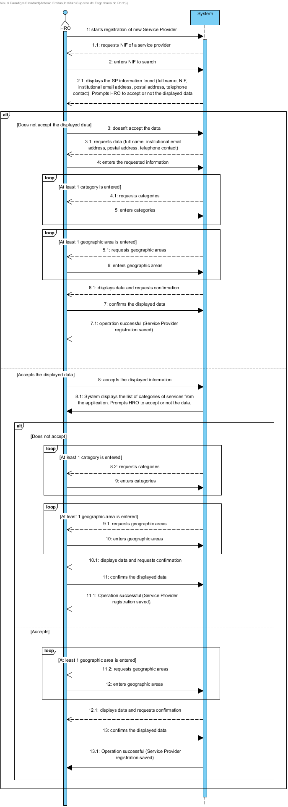

# UC8 - Register Service Provider

## Brief Description

The HRO starts registering the new service provider. System requests the NIF of the service provider to register. The HRO indicates the NIF of the service provider to be registered. System presents the data of the service provider obtained through the application verified and accepted by the company (i.e. full name, NIF, institutional email, postal address, telephone, service categories) and requests confirmation.  The HRO confirms data or proceeds to edit it. The system validates and displays data, asking to confirm. The HRO confirms the data presented by the system. The system registers the data of the new service provider and informs the HRO of the success of the operation. The system sends the authentication data to the new Service Provider.

## SSD

## Full Description

### Primary Actor

Human Resources Officer (HRO)

### Stakeholders and Interests
* **HRO** intends to register the Service Providers so that it is possible to make available the services provided by the company.
* **Company:** intends that the Service Provider be available to perform the services requested by clients.
* **Service Provider** needs to have an access profile to indicate their availability in order to perform the services requested by the Company's customers.

### Preconditions
The pre-existence of Service Categories and Geographic Areas defined in the system.

### Postconditions
The service provider registration information is stored in the system.

## Main Success Scenario

1. The HRO starts registering the new service provider.
2. System requests the NIF of the service provider to register.
3. The HRO indicates the NIF of the service provider to be registered.
4. System presents the data of the service provider obtained through the application verified and accepted by the company (i.e. full name, NIF, institutional email, postal address, telephone, service categories) and requests confirmation.
5. The system allows the HRO to confirm the displayed data or to enter new data - **alternate 1 (alt 1)**
6. (Acceptance of pre-filled data obtained through the application)
a) **alt 1a->**  The HRO does not accept the data and starts manually entering the data.
    6.1. The HRO enters the requested data.
		6.2. The system shows the existing service categories and requests one.
		6.3. The HRO selects the service category.
		6.4. The system validates and stores the selected category.
		6.5. Steps 6.2 to 6.4 repeat until all desired categories are selected (minimum 1).
		6.6. The system shows the existing geographic areas and requests one.
		6.7. The HRO selects the intended geographical area.
		6.8. System validates and stores the selected geographic area.
		6.9. Steps 6.6 to 6.8 repeat until all the desired geographic areas are selected (minimum 1).
		6.10. The system validates and displays data, asking for confirmation.
		6.11. HRO confirms.
		6.12. The system registers data of the new Service Provider, sends the authentication information to the new Service Provider and informs the HRO of the success of the operation.
b) **alt 1b->** The HRO accepts and confirms the data provided by the system.
		6.1. System shows the service categories of the application.
		6.2. The system has the option to confirm the categories presented or to choose categories again - **alternate 2 (alt 2)**
6.3. (Acceptance of pre-filled categories obtained through the application)
a) **alt 2a->** The HRO does not accept categories and starts selecting new categories.
				6.3.1. The system shows the existing service categories and requests one.
				6.3.2. The HRO selects the desired service category.
				6.3.3. The system validates and stores the selected category.
				6.3.4. Steps 6.3.1 to 6.3.3 repeat until all the desired categories are selected (minimum 1).
				6.3.5. The system shows the existing geographic areas and requests one.
				6.3.6. The HRO selects the intended geographical area.
				6.3.7. The system validates and stores the selected geographic area.
				6.3.8. Steps 6.3.5 to 6.3.7 repeat until all the desired geographic areas are selected (minimum 1).
				6.3.9. The system validates and displays data, asking for confirmation..
				6.3.10. The HRO confirms.
				6.3.11. The system registers data of the new Service Provider, sends the authentication information to the new Service Provider and informs the HRO of the success of the operation.
b) **alt 2b->** The HRO accepts the categories - continues for enumeration 7.
7. The system shows the existing geographic areas and requests one.
8. The HRO selects the intended geographical area.
9. The system validates and stores the selected geographic area.
10. Steps 7 to 9 repeat until all the desired geographic areas are selected (minimum 1).
11. The system validates and displays data, asking for confirmation.
12. The HRO confirms.
13.	The system registers data of the new Service Provider, sends the authentication information to the new Service Provider and informs the HRO of the success of the operation.

### Exception Conditions (alternative flow)

*a. The HRO requests cancellation of registration.

> The use case ends.

3a. The HRO enters an invalid NIF.
> 1. The system informs that the NIF is not valid and re-requests NIF.
> 2. HRO submits. The use case continues.

3b. The duplication of id number and/or full/abbreviated name and/or email.
>	1. The system informs the HRO about the duplication of data.
>	2. The system allows the introduction of new data.
>
	>	2a. The HRO does not change the data. The use case ends.

4a. The system does not detect any applications containing the NIF entered.
>	1. The system requests all the necessary data for the registration of Service Provider.
>
	>	2a. The HRO does not fill in the requested data. The use case ends.

4b. The system detects that there is already a registered Service Provider with the NIF entered.
>	1. The system alerts the HRO to the fact.
>	2. The system allows to change it.
>
	>	2a. The HRO does not change the data. The use case ends.

6a. Incomplete / duplicate category data.
>	1. The system reports missing or duplicate data.
>	2. The system allows you to enter new data.
>
	>	2a. The HRO does not change data. The use case ends.

10a. Incomplete / duplicate Geographic Area data.
  >	1. The system reports missing or duplicate data.
  >	2. The system allows you to enter new data.
  >
  	>	2a. The HRO does not change the data. The use case ends.

12a. The system detects that the data (or some subset of data) entered must be unique and already exist in the system.
>	1. The system alerts the HRO to the fact.
>	2. The system allows to change it.
>
	>	2a. The HRO does not change the data. The use case ends.

12b. The system detects that the entered data (or some subset of data) is invalid.
>	1. The system alerts the HRO to the fact.
>	2. The system allows to change it.
>
	> 2a. The HRO does not change the data. The use case ends.*

### Special Requirements
\-

### Variations in Technologies and Data
\-

### Frequency of Occurrence
\-

### Open Questions

* Are there other mandatory data besides those already known?
* What data together allow to detect the duplication of Service Providers?
* What are the security rules that apply to access data?
* How is it defined which email system to use?
* How often does this use case occur?
