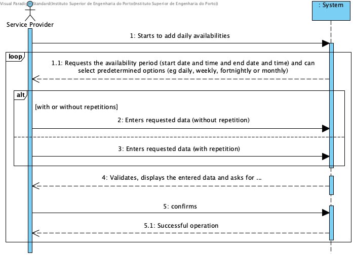

# UC9 - Add Daily Availability

## Brief Description

The service provider starts identifying his/her daily availability. The system requests the required data (i.e. date/time start and end), and may select predetermined options for repetitions (e.g. daily, weekly, biweekly or monthly). The service provider enters the requested data. The system validates and presents the data to the service provider for confirmation. The service provider confirms. The system records the availability of the service provider and informs the service provider of the success of the operation.

## SSD

## Full Description

### Primary Actor

Service provider

### Stakeholders and their interests
* **Service provider:** is intended to indicate daily availability to perform services.
* **Company:** wants the daily availability of service providers to be specified in the system.

### Preconditions
n/a

### Postconditions
Information about the daily availability of the service provider is recorded in the system.

## Main Success Scenario

1. The service provider initiates the identification of their daily availability.
2. The system requests a period (start date/time and end date/time) in which the service provider is available to perform services, and may choose predetermined options for repetitions (e.g. daily, weekly, biweekly or monthly).
3. The service provider enters the requested data.
4. The system validates and displays the data for confirmation.
5. The service provider confirms.
6. The system records the availability period of the service provider and informs the service provider of the success of the operation.
7. Steps 2 to 6 shall be repeated until the service provider has indicated all his availabilities.

### Exception conditions (alternative flow)

*a. The service provider requests the cancellation of the hourly availability indication.

> The use case ends.

4a. Data that identifies the availability period is incomplete.
> 1. The system informs you of missing data.
> 2. The system allows the missing data to be entered (step 3)
>
> 2a. The service provider does not change the data. The use case ends.

4b. The system detects that the entered data (or some subset of the data) is invalid.
> 1. The system alerts the service provider to the fact.
> 2. The system allows you to change it (step 3).
>
> 2a. The service provider does not change the data. The use case ends.

4c. The system detects that the indicated availability overlaps (i.e., intercept) with another availability indicated above.
> 1. The system alerts the service provider to the fact.
> 2. The system allows you to change it (step 3)
>
> 2a. The service provider does not change the data. The use case ends.

### Special Requirements
\-

### Variations in Technologies and Data
\-

### Frequency of Occurrence
\-

### Open questions

* Should the service provider indicate the daily availability for each type of service?
* How is the date and time validated? Are there limitations related to the day of the week and working hours (eg 8 am to 6 pm)?
* If the availabilities indicated adopt a standard, which one should be used (eg daily, weekly, monthly)?
* How often does this use case occur?
